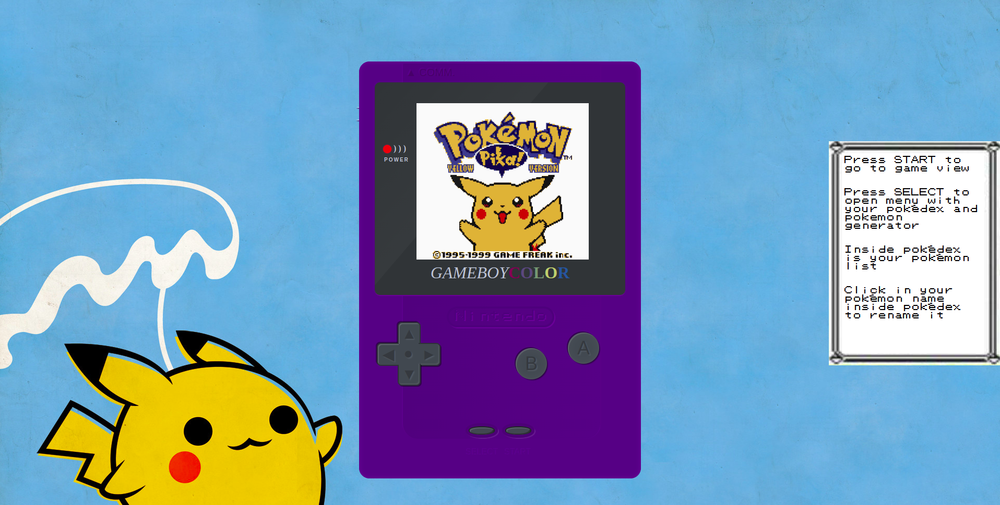

# Monocard Dev Test

<!---Esses são exemplos. Veja https://shields.io para outras pessoas ou para personalizar este conjunto de escudos. Você pode querer incluir dependências, status do projeto e informações de licença aqui--->




> Web App usando pokeapi, express, reactjs e styled components. Iniciado com Vite.


## 💻 Pré-requisitos

Antes de começar, verifique se você atendeu aos seguintes requisitos:
* Você instalou o `<Node>`

## 🚀 Instalando Monocard Dev Test

Para instalar o <Monocard Dev Test>, siga estas etapas:

O primeiro passo para instalar o projeto em sua máquina será clonar o repositório. Caso tenha o Git instalado basta executar o seguinte comando na pasta desejada

```
git clone https://github.com/<seu-nome-no-github>/monocard-dev-test.git
```

Após clonar o projeto será possível observar a existência de duas pastas:

-> frontend

-> backend

Para iniciar o projeto será necessário instalar as dependências tanto do frontend quanto do backend. Para instalar siga os seguintes passos:

Para o frontend:
```
cd frontend

npm install
```

Para o backend:
```
cd backend

npm install
```

Após a finalização da instalação das dependências basta iniciar o frontend e o backend

```
cd frontend

npm run dev
```


```
cd backend

npm start
```


O frontend será iniciado no localhost:3000, certifique-se de que nada esteja rodando nesta porta.

O backend será iniciado no localhost: 8000, certifique-se de que nada esteja rodando nesta porta.


Após estes passos basta acessar o localhost:3000 em seu navegador :)


## ☕ Usando <Monocard Dev Test>
 
Navegador recomendado: Google Chrome

Para usar <Monocard Dev Test>, siga estas etapas:

*Acesse o endereço localhost:3000

*Ao abrir a página você será direcionado para a tela inicial do projeto. Pressione o botão de START para ir para tela GameView;

*Na GameView basta clicar no botão de SELECT que abrirá um menu com duas opções: Generate pokémon e Pokédex;

*Na tela de geração do pokémon será gerado um pokémon aleatório, que será salvo em sua pokédex;

*Para acessar sua pokédex, basta clicar na opção de pokédex no menu;

*A pokédex exibirá a lista de pokémons com a opção para renomear seus pokémons;

*Para renomear o pokémon basta clicar no nome e digitar o novo nome desejado;


## 🤝 Colaboradores

Agradecemos às seguintes pessoas que contribuíram para este projeto:

<table>
  <tr>
    <td align="center">
      <a href="#">
        <br>
        <sub>
          <b>Lucas Russo</b>
        </sub>
      </a>
    </td>
  </tr>
</table>


## 📝 Referências

*NodeJS -> <a href="https://nodejs.dev/">aqui</a>

*Vite -> <a href="https://vitejs.dev/">aqui</a>

*Express -> <a href="https://expressjs.com/pt-br/">aqui</a>

*Styled Components -> <a href="https://styled-components.com/">aqui</a>

*Component de gameboy -> <a href="https://codepen.io/luismsf/pen/kOyQbR">aqui</a>

[⬆ Voltar ao topo](#monocard-dev-test)<br>
